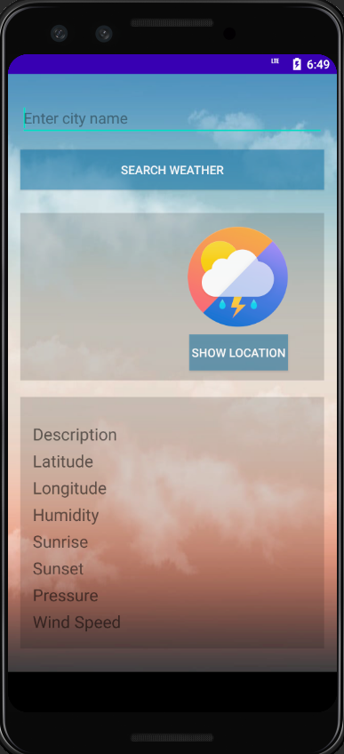
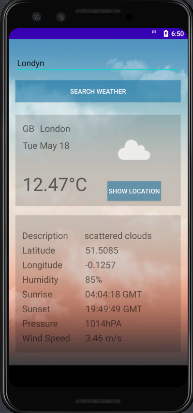
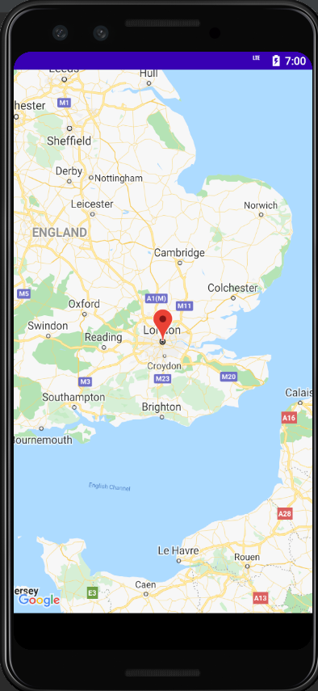
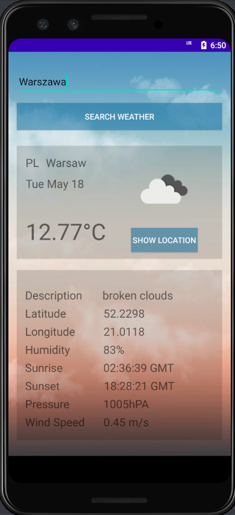
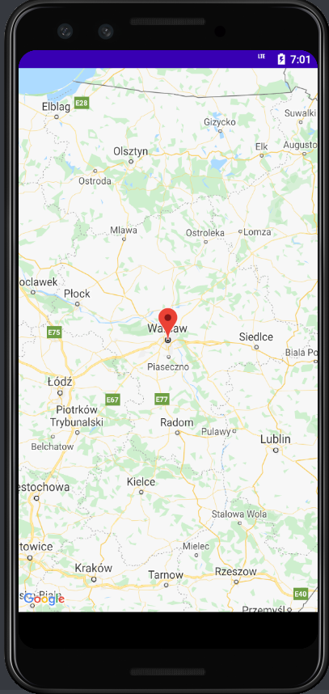
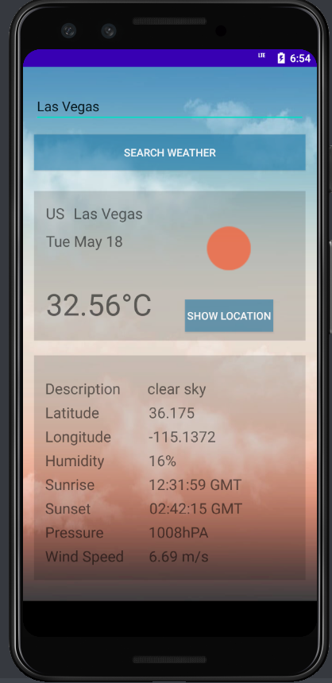
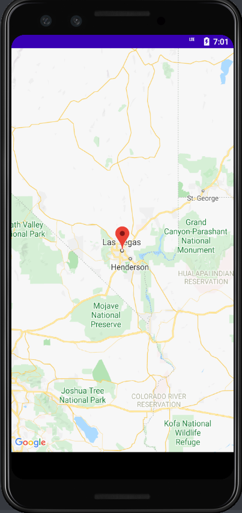

# SkyLens
Android project of a weather app called "SkyLens" using Java.

## Table of contents
* [General info](#general-info)
* [Using the app](#using-the-app)
* [Status](#status)
* [Authors](#authors)

## General info

This project was developed using Android Studio. It uses both OpenWeather API and Google Maps API. The app allowes you to type in a city name and see its current weather by parsing the API response. It also uses Picasso Library to display weather icons based on weather description and time of the day. Moreover, the user is able to see the chosen location on the map by simply clicking the "Show Location" button.

## Using the app

This application aims to be an intuitive tool for everyday use.

  
On the main screen of the app, the user is able to type in the city name and confirm it by clicking the "Search Weather" button.     
   
  
Current weather in London.  
   
  
Location of the chosen city on the map, after clicking the "Show Location" button.  
   
  
Current weather in Warsaw.  
  
  
Location of the chosen city on the map, after clicking the "Show Location" button.  
   
  
Current weather in Las Vegas.  
  
Location of the chosen city on the map, after clicking the "Show Location" button.  
  
 
## Status
The project you can find here is fully operational, no more functions will be added in the future. 

## Authors
Created by [DrelaDominika](https://github.com/DrelaDominika) and [PrzemyslawStachurski](https://github.com/PrzemyslawStachurski) - feel free to contact us!
